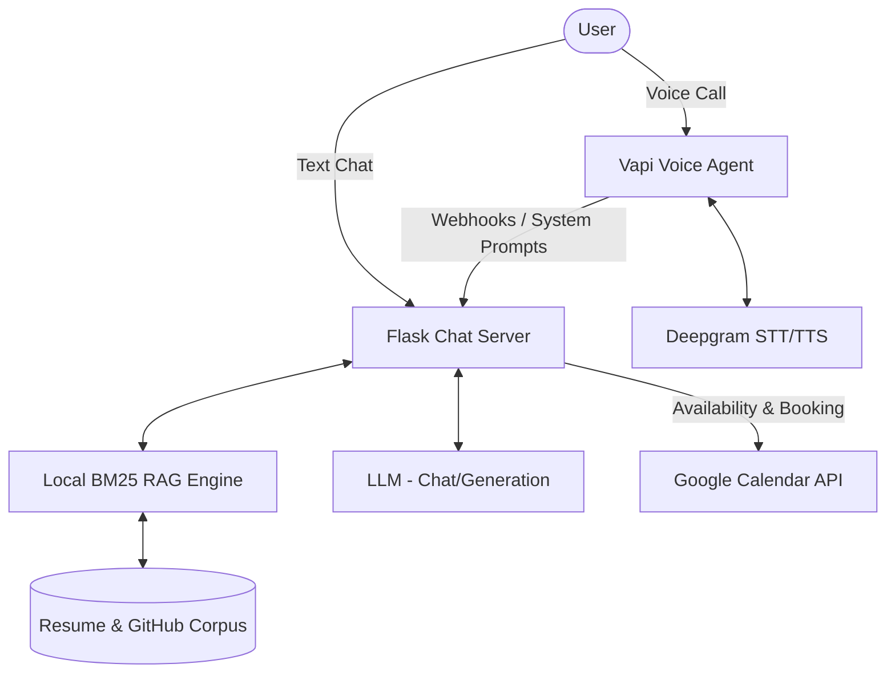

# Public AI Representative & Voice Agent

This project is an AI persona that can be interacted with via chat or voice. It is grounded in a real resume and live GitHub repository commit histories, and it can book actual calendar events via Google Calendar API.

## Architecture Diagram



## Setup Instructions

1. **Clone the repository:**
   ```bash
   git clone <repo-url>
   cd shaan-chatbot
   ```

2. **Install dependencies:**
   ```bash
   pip install -r requirements.txt
   ```

3. **Configure Environment:**
   Create a `config.json` with your API keys (Google Calendar, LLM, Vapi).
   Ensure `google_credentials.json` is placed in the root directory for calendar access.

4. **Run the Chat Server:**
   ```bash
   python app.py
   ```
   The server will start on port 5001.

5. **Run the Voice Admin Dashboard (Optional):**
   ```bash
   cd ../voice-agent-interview
   python app.py
   ```

## Cost Breakdown

- **Chat Sessions:** $0 (Using local BM25 RAG and free-tier LLMs where applicable).
- **Voice Calls:** ~$0.18 per minute (Vapi platform fee of $0.15/min + Deepgram STT/Cartesia TTS costs).
